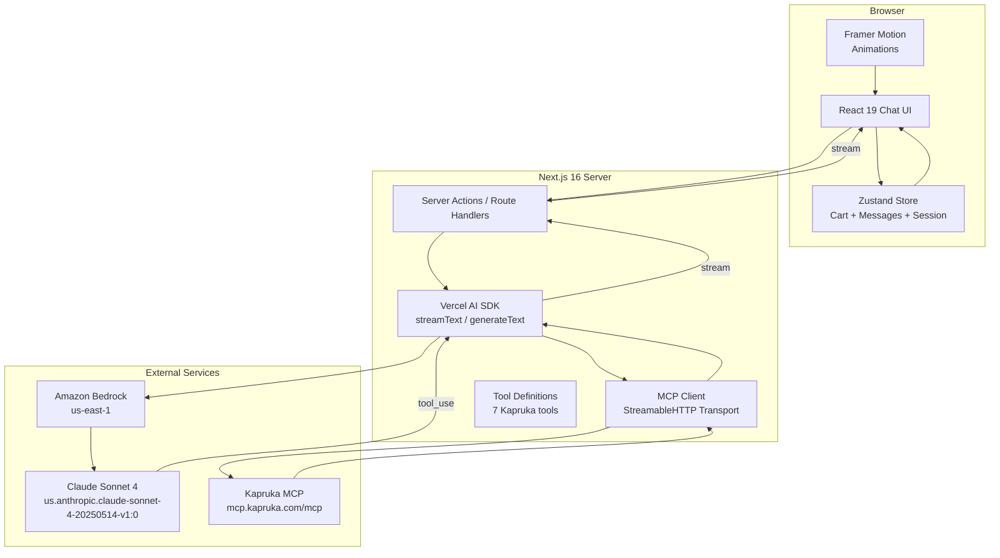
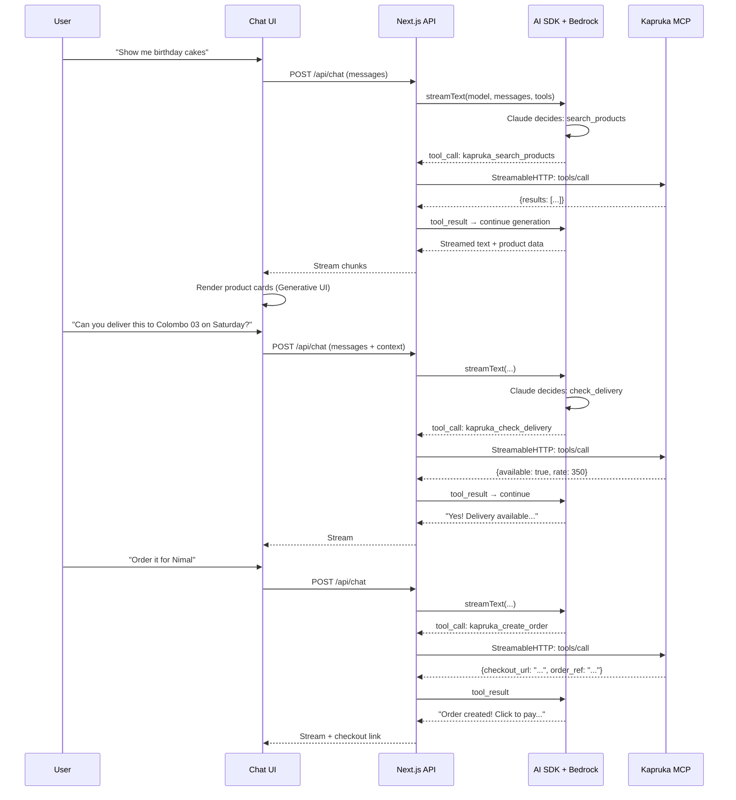
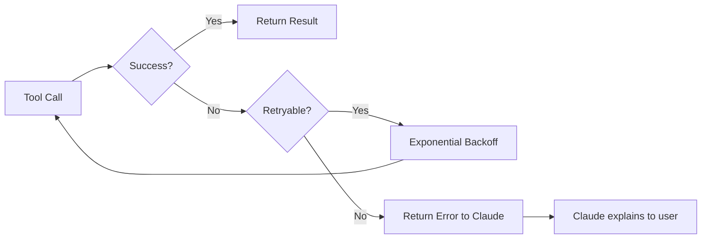

# Architecture Notes

## System Architecture



## Data Flow: Complete Shopping Conversation



## Key Design Decisions

### 1. Server-Side MCP Connection Only

The MCP client MUST run server-side (API routes / server actions). Reasons:
- AWS credentials are never exposed to the browser
- Rate limiting is per-IP; a single server IP makes tracking predictable
- StreamableHTTP transport requires persistent connections

### 2. Tool Registration with Vercel AI SDK

The AI SDK's `tools` parameter maps MCP tools to Claude's tool-calling format:

```typescript
const tools = {
  kapruka_search_products: {
    description: "...",
    parameters: z.object({
      params: z.object({
        q: z.string().min(3),
        // ... rest of schema
      })
    }),
    execute: async (args) => {
      // Call MCP tool via client
      return await mcpClient.callTool("kapruka_search_products", args);
    }
  }
};
```

### 3. Streaming Architecture

- Use `streamText()` for real-time token streaming
- Tool calls are executed mid-stream
- `useChat()` hook on client handles stream parsing
- Generative UI components render from structured tool results

### 4. State Management

```
Zustand Store
├── messages[]         - Chat history (persisted to localStorage)
├── cart[]             - Shopping cart items
├── deliveryInfo       - Selected city, date, address
├── recipientInfo      - Name, phone
└── sessionId          - For server-side state correlation
```

### 5. Rate Limiting Strategy

| Approach | Implementation |
|----------|---------------|
| Client-side throttle | Debounce user input, queue tool calls |
| Request counting | Track calls/minute in server memory |
| Graceful degradation | Show "busy" state, retry with backoff |
| Order limit | Max 30/hr is generous; unlikely to hit |

### 6. Error Recovery



## File Structure (Target)

```
kapruka-ai-shopping-agent/
├── app/
│   ├── layout.tsx
│   ├── page.tsx                    # Chat interface
│   ├── globals.css
│   └── api/
│       └── chat/
│           └── route.ts            # AI SDK streaming endpoint
├── lib/
│   ├── bedrock.ts                  # Bedrock client config
│   ├── mcp-client.ts              # MCP connection manager
│   ├── tools.ts                    # Tool definitions for AI SDK
│   └── store.ts                    # Zustand store
├── components/
│   ├── chat/
│   │   ├── chat-container.tsx
│   │   ├── message-bubble.tsx
│   │   └── input-bar.tsx
│   ├── products/
│   │   ├── product-card.tsx
│   │   └── product-carousel.tsx
│   ├── delivery/
│   │   ├── city-selector.tsx
│   │   └── date-picker.tsx
│   └── order/
│       ├── cart-summary.tsx
│       └── checkout-link.tsx
├── scripts/
│   ├── inspect-mcp.ts
│   └── test-bedrock.ts
├── docs/
│   ├── mcp-analysis.md
│   ├── tool-schemas.md
│   ├── payload-examples.md
│   └── architecture-notes.md
└── .env.local                      # AWS credentials (gitignored)
```

## Technology Constraints

| Constraint | Impact |
|-----------|--------|
| Next.js 16 (App Router) | Must use server components, route handlers, streaming |
| React 19 | Server components, use() hook, transitions |
| `additionalProperties: false` on all MCP inputs | No extra fields allowed; strict schema adherence |
| Output is always `{ result: string }` | Must JSON.parse the result string even in JSON mode |
| 3-page pagination cap | Cannot enumerate full catalog; search must be targeted |
| 60 req/min rate limit | ~1 request/second sustained; multi-tool chains need care |
| Checkout URL expires in 60 min | Must communicate urgency to user |

## Critical Implementation Notes

1. **Params wrapper**: Every tool call wraps arguments in `{ params: {...} }`. The AI must be prompted to do this correctly.

2. **Double-parse outputs**: The MCP returns `{ result: "..." }` where `result` is a JSON string. You must `JSON.parse(result.result)` to get structured data.

3. **Perishable date validation**: The MCP server handles this, but the UI should also prevent past-date selection client-side for better UX.

4. **Order number vs order_ref**: After `create_order`, the user gets an `order_ref`. But `track_order` needs the actual order number from the payment confirmation email — these are different identifiers.

5. **City name matching**: Use `list_delivery_cities` output verbatim as input to `check_delivery` and `create_order`. Don't normalize or abbreviate.
