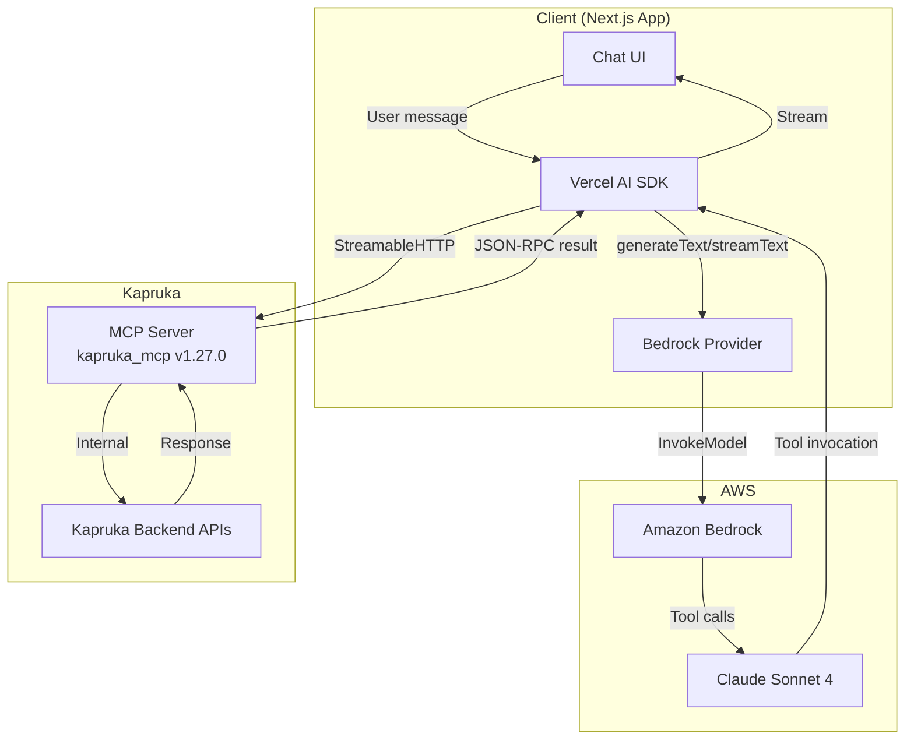

# MCP Endpoint Analysis

## Connection Details

| Property | Value |
|----------|-------|
| **Endpoint URL** | `https://mcp.kapruka.com/mcp` |
| **Transport** | StreamableHTTP (modern MCP protocol) |
| **Server Name** | `kapruka_mcp` |
| **Server Version** | `1.27.0` |
| **Protocol** | JSON-RPC over HTTP with SSE streaming |

## Server Capabilities

```json
{
  "experimental": {},
  "prompts": { "listChanged": false },
  "resources": { "subscribe": false, "listChanged": false },
  "tools": { "listChanged": false }
}
```

- **Tools**: 7 available (static, `listChanged: false`)
- **Resources**: Exposed but no subscription support
- **Prompts**: Available but static
- **Experimental**: Empty (no experimental features)

## Transport Discovery

The client attempted both transport mechanisms:
1. **StreamableHTTP** (modern, `2025-03-26` protocol) - **SUCCESS**
2. **SSE** (legacy, `2024-11-05` protocol) - Not attempted (StreamableHTTP succeeded)

**Important**: Despite the blueprint mentioning "SSE Transport Protocol", the server actually uses the newer StreamableHTTP transport. The MCP SDK handles both seamlessly.

## Rate Limits

| Limit | Value | Source |
|-------|-------|--------|
| General API | 60 requests/min/IP | Blueprint |
| Order creation | 30 orders/hour/IP | Tool description |
| Search pagination | Max 3 pages per query | Tool description |

## Authentication

- **None required** for tool invocation
- Guest checkout for orders (no Kapruka account needed)
- Idempotency keys auto-generated per order call

## Tool Inventory (7 tools)

| # | Tool Name | Read-Only | Idempotent | Purpose |
|---|-----------|-----------|------------|---------|
| 1 | `kapruka_list_categories` | Yes | Yes | Browse category tree |
| 2 | `kapruka_get_product` | Yes | Yes | Get product details by ID |
| 3 | `kapruka_search_products` | Yes | Yes | Search catalog |
| 4 | `kapruka_list_delivery_cities` | Yes | Yes | Query deliverable cities |
| 5 | `kapruka_check_delivery` | Yes | No | Check delivery availability/rate |
| 6 | `kapruka_create_order` | No | Yes | Create order + get checkout URL |
| 7 | `kapruka_track_order` | Yes | No | Track existing order status |

## Key Observations

1. **All tools use a `params` wrapper** - Input is always `{ params: { ...fields } }`, not flat fields.
2. **Response format toggle** - Every tool supports `response_format: 'markdown' | 'json'`. For AI agent use, always request `'json'`.
3. **Output is always a string** - The `outputSchema` for every tool is `{ result: string }`. Even in JSON mode, the structured data is serialized as a string within the `result` field.
4. **Server-side caching** - Categories cached 30 minutes. Search results are real-time.
5. **Pagination is cursor-based** - Hard-capped at 3 pages per search query.
6. **Currency support** - LKR, USD, GBP, AUD, CAD, EUR across all pricing tools.
7. **CATSYM filtering** - Category stub entries (non-purchasable) are excluded by default in search.

## Architecture Diagram


